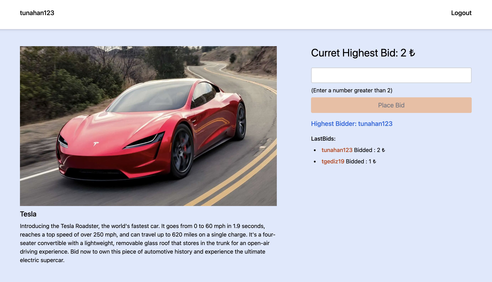

This is a web application that allows users to participate in live auctions. Users can create an account and login to the application in order to bid on the specified products. Node.js is used for the backend and React is used for the frontend. User session information is stored in Redis, while user information is stored in MongoDB. Socket.io is used for real-time communication between the server and clients.



## Technologies Used

**Client:** React, TailwindCSS, socket.io

**Server:** Node, Express, socket.io, mongoDB, Redis

## Usage

#### Clone the project to your local machine

```bash
    git clone https://github.com/tunahangediz/kartaca-auction-case.git
```

#### To run the project with Docker:

```bash
    docker-compose up -d --build
```

#### Localhost ports for the project:

**Client:** http://localhost:3000/

**Server:** http://localhost:4000/
